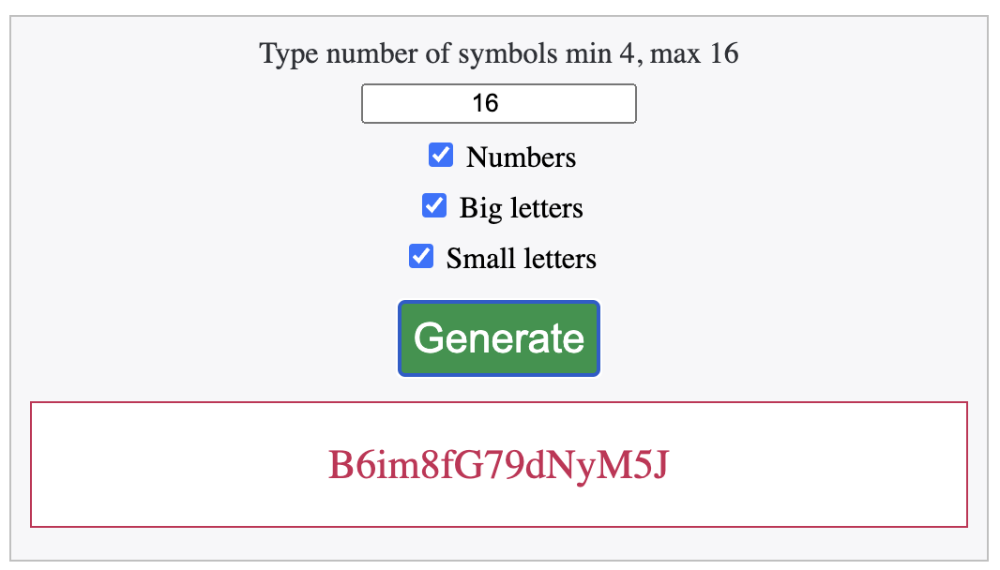

# Service for generate password
1. Clone this repo
2. Run install.sh (will be setup docker container and install all dependencies)
3. You are ready for use. Go to http://localhost:55557 enjoy.
4. Console uses, example: bin/console generate:password 16
